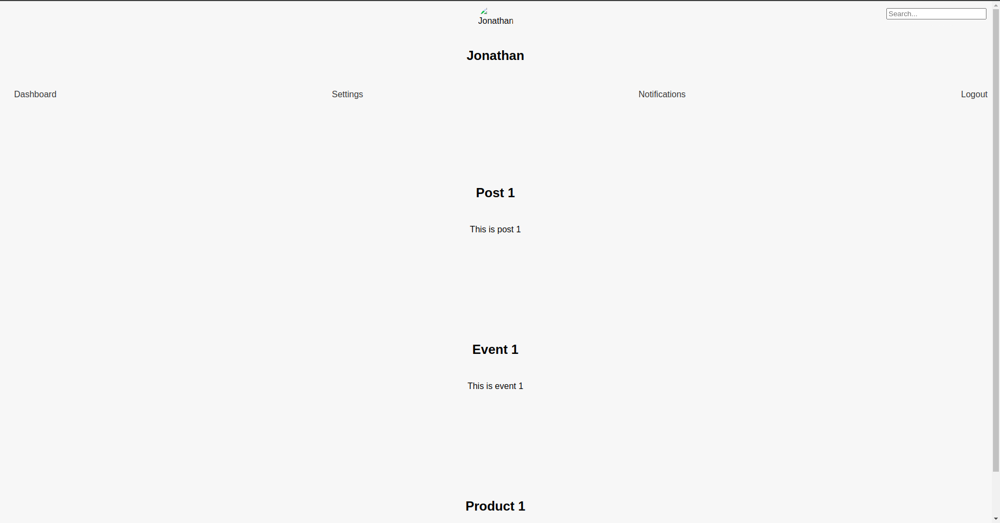

# ChatBot  🤖

**ChatBot** é um bot interativo no Telegram que gera e apresenta o código
HTML e CSS de uma imagem fornecida pelo usuário. Utilizando a API Llama e
o modelo mistral do Ollama, o bot interpreta a imagem recebida, cria um 
código HTML e CSS correspondente, e responde ao usuário no chat. Essa 
aplicação facilita a criação de estrutura de páginas web com base em 
imagens e serve como um recurso educativo e prático para iniciantes e 
desenvolvedores em CSS e HTML.


Link das previews: https://frontend-chat-preview.vercel.app

## Como fazer funcionar localmente ⚙️

1. Em sua máquina, instale o Ollama ```sudo snap install ollama```
2. Em seguida instale o modelo `llama2:7b` do ollama ```ollama run llama2:7b```
3. Clone o repositório
4. Aguarde o arquivo `pom.xml` baixar as dependências
5. Crie um bot no Telegram seguindo este passo a passo<br>
   5.1. Procure o `BotFather` no Telegram, ele terá um símbolo de verificado e 2,4 milhões de usuários mensais<br>
   5.2. Digite `/start`, veja as opções e crie um novo bot com `/newbot`<br>
   5.3. Nomeie o seu bot e crie um usurname para ele<br>
   5.4. Gere um token com `/token` <br>
7. Crie um arquivo `.env` na raíz do projeto e coloque o seu TOKEN no `TELEGRAM_TOKEN`, assim como mostra o `.env.example`
8. Coloque no `.env` um TOKEN seu gerado no Github com permissões de `repo` no `ACCESS_TOKEN`, assim como mostra o `.env.example`
9. Vá ao arquivo `Main.java` e execute

## Prompts bem sucedido

```
Generate responsive HTML and CSS code for a web app interface with these features:
- A purple and white color scheme.
- Top section: user profile with the name 'Jonathan' and a placeholder profile picture.
- Middle section: three cards for 'posts', 'events', and 'products', each with a thumbnail, title, and description.
- Bottom section: navigation menu on the left with items like 'Dashboard', 'Settings', 'Notifications', and 'Logout'. Include a search bar in the top-right corner.
```

Resposta:
```
<!DOCTYPE html>
<html lang="en">
<head>
  <meta charset="UTF-8">
  <meta name="viewport" content="width=device-width, initial-scale=1.0">
  <title>Jonathan's Web App</title>
  <style>
      /* Global Styles */
      body {
          font-family: Arial, sans-serif;
          margin: 0;
          padding: 0;
      }
      .container {
          display: flex;
          flex-direction: column;
          align-items: center;
          justify-content: space-between;
          height: 100vh;
          margin: 0 auto;
          padding: 20px;
          background-color: #f7f7f7;
      }
      .top-section {
          display: flex;
          flex-direction: column;
          align-items: center;
          justify-content: center;
          height: 300px;
          margin-bottom: 20px;
      }
      .profile-picture {
          width: 150px;
          height: 150px;
          border-radius: 50%;
          margin: 0 10px;
      }
      .user-profile {
          margin-bottom: 20px;
          font-size: 18px;
          color: #333;
          text-align: center;
      }
      .posts-cards, .events-cards, .products-cards {
          display: flex;
          flex-direction: column;
          align-items: center;
          justify-content: space-between;
          height: 300px;
          margin-bottom: 20px;
      }
      .posts-card {
          background-color: #fff;
          border: 1px solid #ddd;
          padding: 10px;
          box-shadow: 0 0 10px rgba(0, 0, 0, 0.2);
      }
      .events-card {
          background-color: #fff;
          border: 1px solid #ddd;
          padding: 10px;
          box-shadow: 0 0 10px rgba(0, 0, 0, 0.2);
      }
      .products-card {
          background-color: #fff;
          border: 1px solid #ddd;
          padding: 10px;
          box-shadow: 0 0 10px rgba(0, 0, 0, 0.2);
      }
      .nav-links {
          display: flex;
          justify-content: space-between;
          margin-bottom: 20px;
      }
      .nav-link {
          color: #333;
          text-decoration: none;
          font-size: 16px;
      }
  </style>
</head>
<body>
  <div class="container">
      <div class="top-section">
          
          <div class="user-profile">Jonathan</div>
      </div>
      <div class="nav-links">
          <a href="#" class="nav-link">Dashboard</a>
          <a href="#" class="nav-link">Settings</a>
          <a href="#" class="nav-link">Notifications</a>
          <a href="#" class="nav-link">Logout</a>
      </div>
      <div class="posts-cards events-cards products-cards">
          <div class="posts-card">Post 1</div>
          <div class="events-card">Event 1</div>
          <div class="products-card">Product 1</div>
          <div class="posts-card">Post 2</div>
          <div class="events-card">Event 2</div>
          <div class="products-card">Product 2</div>
      </div>
  </div>
  <script src=""></script>
</body>
</html>
```

[Site gerado](https://frontend-chat-preview.vercel.app/2eaff354-539f-4501-bdd5-4d1cfad574fa.html):

